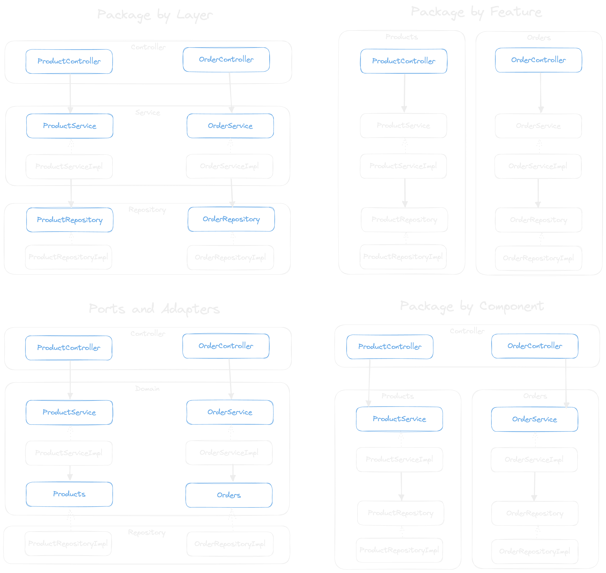

# Clean architecture - samples

The goal is to show possible implementations of the different architecture styles mentioned by [Clean Architecture](https://www.amazon.de/-/en/Robert-C-Martin/dp/0134494164)

# Mentioned patterns

**Notes**:

- blue objects are visible in the project
- dotted line => implementing an interface
- solid show => usage of an interface

## Issues

# Languages

Ideally we can show the implementations with different languages/Frameworks.

I will start with typescript/nestjs as I am currently working with it :)

The result should be placed inside a folder within the [packages](packages/) folder, following a naming scheme something like `[lang]_[framework]_[pattern name]`.

Notes:

- [typescript/nest](docs/typescript.md)
